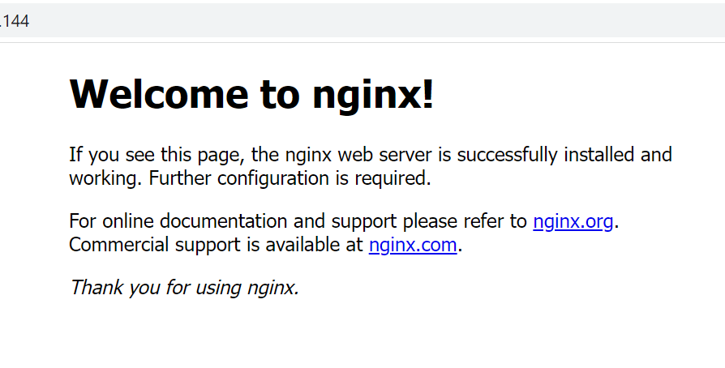

## Step 1 – Installing the Nginx Web Server

Use the following to update the server, intsall nginx and confirm that it is working

        $ sudo apt update
        $ sudo apt install nginx
        $ sudo systemctl status nginx

Open TCP port 80 on the server and confirm that nginx is running on our local host with the curl command

       $ curl http://localhost:80

        $ curl http://127.0.0.1:80
        
Now test how  Nginx server can respond to requests from the Internet by access it through a web browser.

http://3.238.193.130:80

Output 
