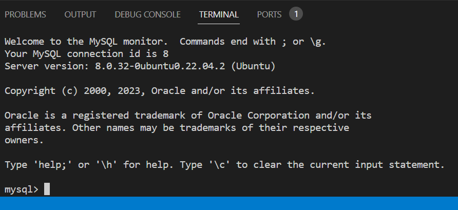

## STEP 2 — INSTALLING MYSQL

Install and log into mysql with the following commands

     $ sudo apt install mysql-server
     $ sudo mysql

 The output 

     Set password for the root user as follows and exit mysql

     ALTER USER 'root'@'localhost' IDENTIFIED WITH mysql_native_password BY 'PassWord.1';

     mysql> exit 

     $ sudo mysql_secure_installation

Set up a pass word and exit mysql
Test if you’re able to log in to the MySQL console with the password and then exit mysql  

    $ sudo mysql -p
    mysql> exit
Start the interactive script by running:

$ sudo mysql_secure_installation

I reset the password to Karmo1974$
I confirmed that I was able to log into my database by running this command; and then exited

$ sudo mysql -p

