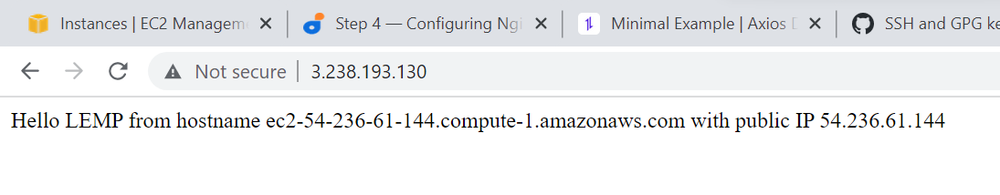

##  Configuring Nginx to Use PHP Processor

Create the root web directory for your_domain as follows and change ownership of the directory to "user"

$  sudo mkdir /var/www/projectLEMP

$   sudo chown -R $USER:$USER /var/www/projectLEMP

Then, open a new configuration file in Nginx’s sites-available directory using your preferred command-line editor, vim.

$  sudo vim /etc/nginx/sites-available/projectLEMP

In the new configuration file, paste the following command

#/etc/nginx/sites-available/projectLEMP

server {
    listen 80;
    server_name projectLEMP www.projectLEMP;
    root /var/www/projectLEMP;

    index index.html index.htm index.php;

    location / {
        try_files $uri $uri/ =404;
    }

    location ~ \.php$ {
        include snippets/fastcgi-php.conf;
        fastcgi_pass unix:/var/run/php/php8.1-fpm.sock;
     }

    location ~ /\.ht {
        deny all;
    }

}

Activate your configuration by linking to the config file from Nginx’s sites-enabled directory:

$ sudo ln -s /etc/nginx/sites-available/projectLEMP /etc/nginx/sites-enabled/

This will tell Nginx to use the configuration next time it is reloaded. You can test your configuration for syntax errors by typing:

$ sudo nginx -t

Disable default Nginx host that is currently configured to listen on port 80 by running this command:

$  sudo unlink /etc/nginx/sites-enabled/default

Reload nginx thus :
$  sudo systemctl reload nginx

Your new website is now active: access from the terminal :-

sudo echo 'Hello LEMP from hostname' $(curl -s http://169.254.169.254/latest/meta-data/public-hostname) 'with public IP' $(curl -s http://169.254.169.254/latest/meta-data/public-ipv4) > /var/www/projectLEMP/index.html

access from the browser:-

http://3.238.193.130:80

This is the image   

