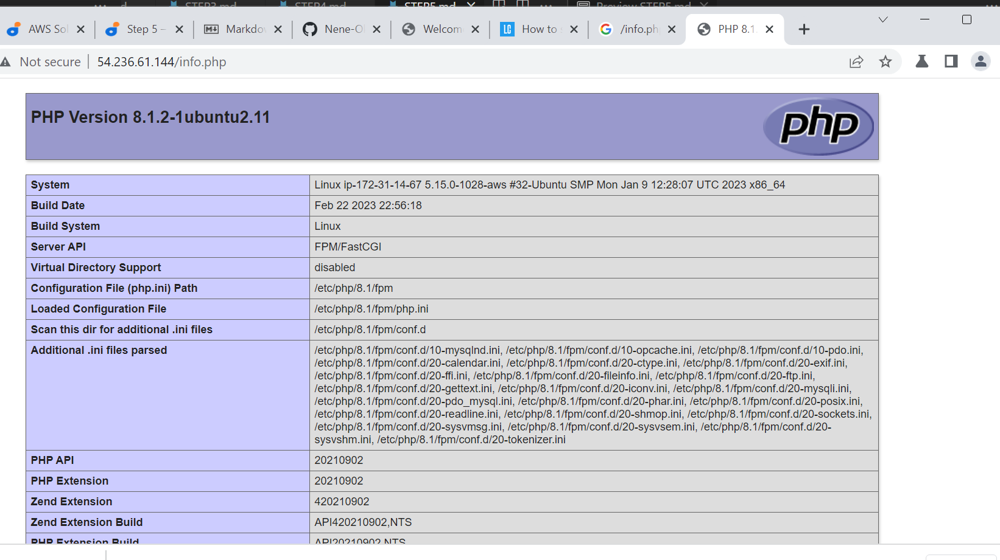

##  Testing PHP with Nginx

To validate that Nginx can correctly hand .php files off to your PHP processor, create a test PHP file in your document root, info.php within your document root thus:

$ sudo vim/var/www/projectLEMP/info.php

Paste and save this php code <?php phpinfp();

Use this to access the page from the browser:
http://`server_domain_or_IP`/info.php

Output 

Remove the file with this command because it contains sensitive document
$  sudo rm /var/www/your_domain/info.php

