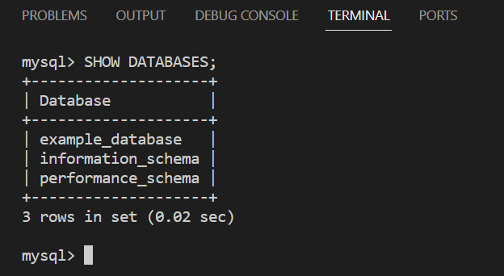
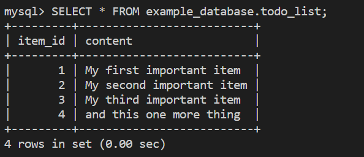
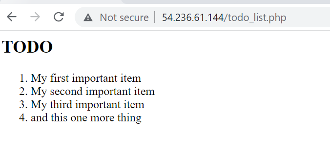

##  Step 6 — Retrieving data from MySQL database with PHP

First, connect to the MySQL console using the root account

     sudo mysql -p

Next create a Database, `example_database` 

mysql> CREATE DATABASE `example_database`;

Then create a new user, `example_user` and grant him full access to the database, `example_datbase`

mysql>  CREATE USER 'example_user'@'%' IDENTIFIED WITH mysql_native_password BY 'Karmo581$';

mysql> GRANT ALL ON example_database.* TO 'example_user'@'%';

Exit the mysql and log into mysql with the new user, `example_user` and into the database, `example_database` with the following commands:
      
      mysql -u example_user -p
      mysql> SHOW DATABASES;
This will show output the database

Next, insert content into the database using the following command

mysql> INSERT INTO example_database.todo_list (content) VALUES

  ('My first important item'),  
  ('My second important item'), 
 
  ('My third important item'),  
  ('and this one more thing');   

Use this command to view the database content

mysql>  SELECT * FROM example_database.todo_list;

Exit the database and create a php script using this command

vi /var/www/projectLEMP/todo_list.php

Copy and paste this content into the php script and save and close. (i will save the content in STEP6B file so my wesite image can display)
 Run this command in the browser to display your webpage content:
http://3.238.193.130/todo_list.php

This is the output:

